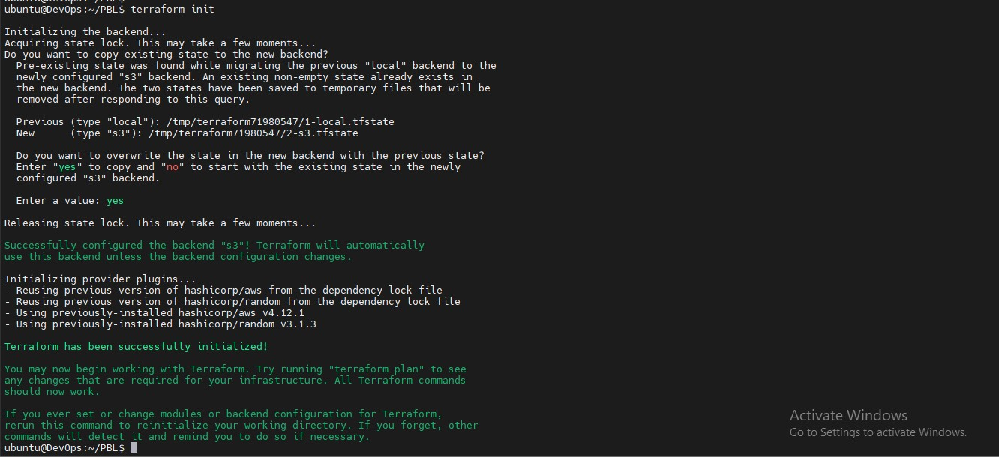
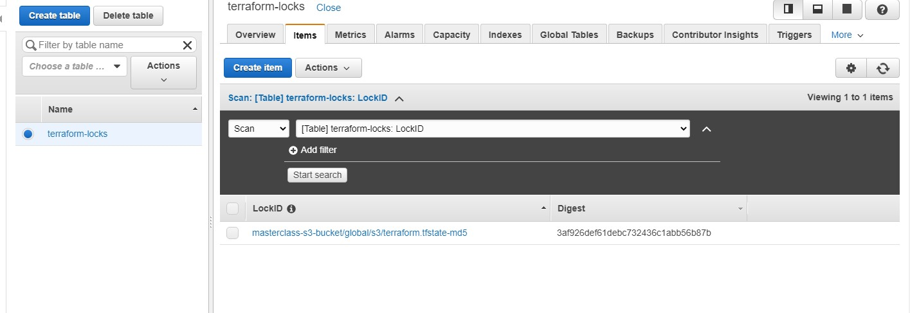
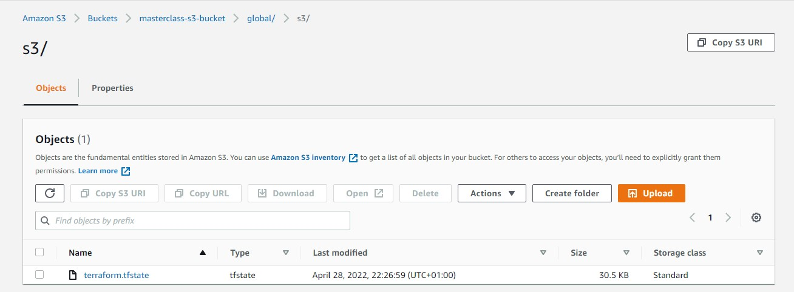
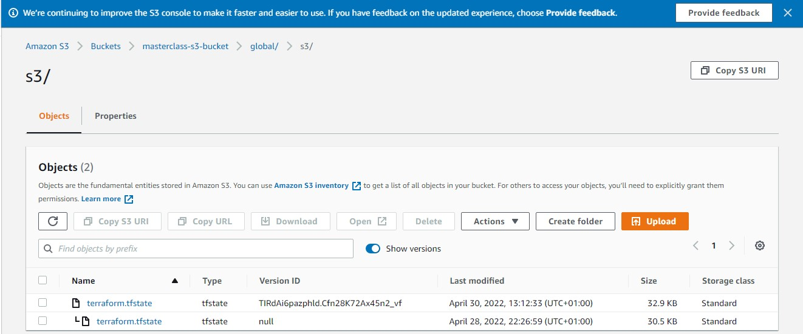

# AUTOMATE INFRASTRUCTURE WITH IAC USING TERRAFORM. PART 3 – REFACTORING #

### Introducing Backend in Terrafrom on S3 ###

Each Terraform configuration can specify a backend, which defines where and how operations are performed, where state snapshots are stored, etc.
*Local backend* – requires no configuration, and the states file is stored locally. This mode can be suitable for learning purposes, 
but it is not a robust solution, so it is better to store it in some more reliable and durable storage.

The second problem with storing this file locally is that, in a team of multiple DevOps engineers, other engineers will not have access to a state file 
stored locally on your computer.
To solve this, we will need to configure a backend where the state file can be accessed remotely other DevOps team members. There are plenty of different 
standard backends supported by Terraform that you can choose from. Since we are already using AWS – we can choose an S3 bucket as a backend.

Another useful option that is supported by S3 backend is State Locking – it is used to lock your state for all operations that could write state. 
This prevents others from acquiring the lock and potentially corrupting your state. State Locking feature for S3 backend is optional and requires 
another AWS service – *DynamoDB*.

### **Create S3 and DynamoDB Resources** ###
1. Create a backend.tf file
1. Add this snippet to the file
~~~
# Note: The bucket name may not work for you since buckets are unique globally in AWS, so you must give it a unique name.
resource "aws_s3_bucket" "terraform_state" {
  bucket = "masterclass-s3-bucket"
  # Enable versioning so we can see the full revision history of our state files
  versioning {
    enabled = true
  }
  # Enable server-side encryption by default
  server_side_encryption_configuration {
    rule {
      apply_server_side_encryption_by_default {
        sse_algorithm = "AES256"
      }
    }
  }
}
~~~
Terraform stores secret data inside the state files. Passwords, and secret keys processed by resources are always stored in there. Hence, you must consider to 
always enable encryption.

create a DynamoDB table to handle locks and perform consistency checks. In previous projects, locks were handled with a local file as shown in 
terraform.tfstate.lock.info. Since we now have a team mindset, causing us to configure S3 as our backend to store state file, we will do the same 
to handle locking. Therefore, with a cloud storage database like DynamoDB, anyone running Terraform against the same infrastructure can use a central 
location to control a situation where Terraform is running at the same time from multiple different people.

Create a DynamoDB resouce in the main.tf file with this code:
~~~
resource "aws_dynamodb_table" "terraform_locks" {
  name         = "terraform-locks"
  billing_mode = "PAY_PER_REQUEST"
  hash_key     = "LockID"
  attribute {
    name = "LockID"
    type = "S"
  }
}
~~~

Terraform expects that both S3 bucket and DynamoDB resources are already created before we configure the backend. 
So, let us run terraform apply to provision resources.

### Configure S3 Backend ###

~~~
terraform {
  backend "s3" {
    bucket         = "masterclass-s3-bucket"
    key            = "global/s3/terraform.tfstate"
    region         = "us.east-1"
    dynamodb_table = "terraform-locks"
    encrypt        = true
  }
}
~~~

Let us re-initialise so as to effectively change the location of the state file to remote.
Run:
~~~
terraform init
~~~

### Verify Changes ###

Lock File in dynamodb

terraform.tfstate file in S3

### Add Terraform Output ###
Before we run terraform apply, add an output so that the S3 bucket Amazon Resource Names ARN and DynamoDB table name can be displayed.

Create a new file and name it *output.tf*, add this code:

~~~
output "s3_bucket_arn" {
  value       = aws_s3_bucket.terraform_state.arn
  description = "The ARN of the S3 bucket"
}
output "dynamodb_table_name" {
  value       = aws_dynamodb_table.terraform_locks.name
  description = "The name of the DynamoDB table"
}
~~~

Terraform will automatically read the latest state from the S3 bucket to determine the current state of the infrastructure. Even if another engineer has applied changes, the state file will always be up to date.

Now, head over to the S3 console again, refresh the page, and click the grey “Show” button next to “Versions.” You should now see several versions of your terraform.tfstate file in the S3 bucket:

### Isolation Of Environments ###
Most likely we will need to create resources for different environments, such as: Dev, sit, uat, preprod, prod, etc.

This separation of environments can be achieved using one of two methods:

1. Terraform Workspaces
1. Directory based separation using terraform.tfvars file

### WHEN TO USE WORKSPACES OR DIRECTORY? ###
To separate environments with significant configuration differences, use a **directory structure**. 
Use **workspaces** for environments that do not greatly deviate from each other, to avoid duplication of your configurations. 

### Security Groups refactoring with dynamic block ###
For repetitive blocks of code you can use dynamic blocks in Terraform.

Refactor Security Groups creation with dynamic blocks.
